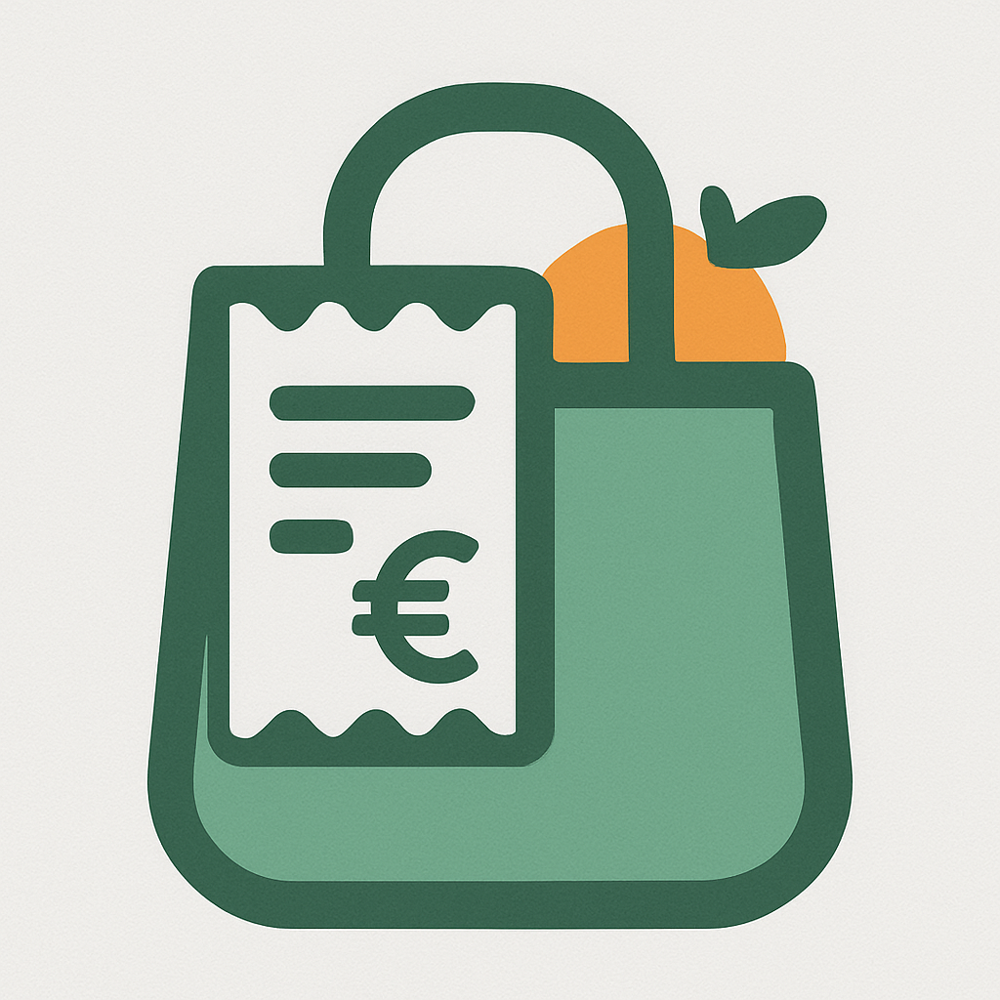

# Grocery Expense Tracker 

  
  <em>Grocery Expense Tracker</em>
   
   
  <em>Desktop application built with Qt6, CMake, and C++. Track your grocery spending, manage monthly budgets, and visualize expense trends with a clean, modern UI and native Windows support. Uses SQLite for persistence.</em>

 

Software Requirements, Tasks, etc. can be found here - [🔗](docs/README.md)

 

_Icon generated by ChatGPT_
